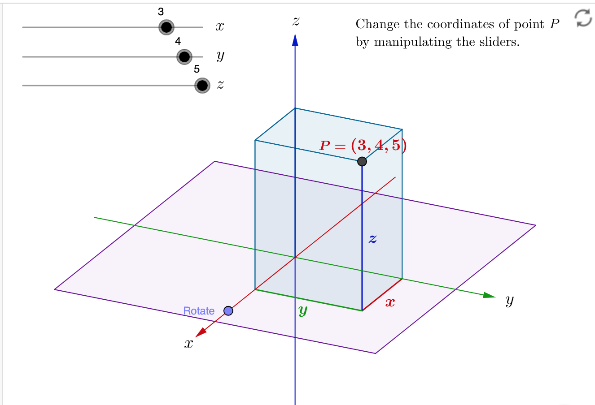

These notes are based on the calculus.

# 多元函数微积分

## 向量代数与空间解析几何

### 向量及其运算

**向量和标量**：
“速度”和“位移”是向量，“速率”和“长度”是标量。几何上向量是有大小和方向的有向线段。向量描述事物间的位移和相对位置，向量不包括“位置”的概念。“点”有位置，但没有大小和厚度。

向量的表示：
$$\bf{a, b, c,} \cdots $$
或者
$$\vec{a}, \vec{b}, \vec{c}, \cdots$$

两个向量的夹角:
$$(\widehat{a,b}) = \phi$$

### 向量的线性运算
**向量的加法和减法**：

向量的加法符合以下规律：
   1. 交换律： $\bf{a + b = b + a} $;
   2. 结合律：$\bf{(a + b) + c = a + (b + c)}$   
**数乘**
向量与数的乘积满足以下运算规律：
   1. 结合律：$\lambda (\mu \bf{a}) = (\lambda \mu)\bf{a}$;
   2. 分配律：$(\lambda + \mu)\bf{a} = \lambda \bf{a} + \mu \bf{a}$, $\lambda \bf{a + b} = \lambda \bf{a} + \lambda \bf{b}$.
> 设向量$\bf{a} \ne \bf{0}$，则向量$\bf{b}$平行于$\bf{a}$的充分必要条件为：$\bf{b} = \lambda \bf{a}$.

--------------------------------------------------------------------
### 空间直角坐标系

# Calculus and its Visualization: an Introduction

Thanks to [**GeoGebra**](https://www.geogebra.org/)

[ **For details, click here:**](https://www.geogebra.org/m/yxadpqun)

教材
======
1. 《高等數學》上下冊（第七版），同濟大學數學系編，高等教育出版社，2014.7
