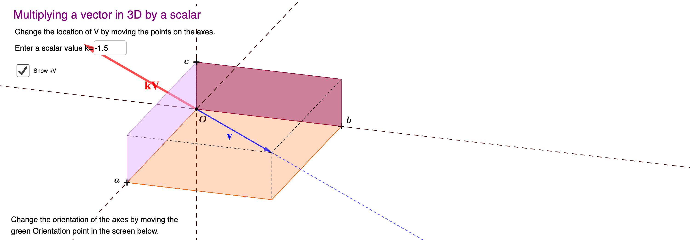

These notes are based on the calculus.

# 多元函数微积分

## 第八章 向量代数与空间解析几何

  
### 第一节 向量及其运算

  
Click to expand!

---
**1. 向量和标量**
“速度”和“位移”是向量，“速率”和“长度”是标量。几何上向量是有大小和方向的有向线段。向量描述事物间的位移和相对位置，向量不包括“位置”的概念。“点”有位置，但没有大小和厚度。

向量的表示：
$$\bf{a, b, c,} \cdots $$
或者
$$\vec{a}, \vec{b}, \vec{c}, \cdots$$

两个向量的夹角:
$$(\widehat{a,b}) = \phi$$

---

**2. 向量的线性运算**
**向量的加法和减法**：

向量的加法符合以下规律：
   1. 交换律： $\bf{a + b = b + a} $;
   2. 结合律：$\bf{(a + b) + c = a + (b + c)}$   

**数乘**
向量与数的乘积满足以下运算规律：
   1. 结合律：$\lambda (\mu \bf{a}) = (\lambda \mu)\bf{a}$;
   2. 分配律：$(\lambda + \mu)\bf{a} = \lambda \bf{a} + \mu \bf{a}$, $\lambda (\bf{a + b}) = \lambda \bf{a} + \lambda \bf{b}$.

---

 **定理1**
设向量$\bf{a} \ne \bf{0}$，则向量$\bf{b}$平行于$\bf{a}$的充分必要条件为：$\bf{b} = \lambda \bf{a}$.

---

**3. 空间直角坐标系**
在空间取定一定点$O$和三个两两相互垂直的单位向量$\bf{i, j, k}$就确定了三条都以$O$为原点的两两相互垂直的数轴，依次记为$x$轴(横轴)，$y$轴(纵轴)，$z$轴(竖轴)，统称为坐标轴。它们构成空间的一个直角坐标系，如下图所示：

[Click: 更详细的动画](https://www.geogebra.org/material/edit/id/yxadpqun#bookcontent)
三条坐标轴的任意两条可以确定一个平面，这样确定的三个坐标平面统称为坐标平面。$x$轴及$y$轴所确定的坐标平面叫做$xOy$面等等。如下图所示：

[Click: 更详细的动画](https://www.geogebra.org/material/edit/id/yxadpqun#bookcontent)

------

**4. 向量坐标表示**
$$M \leftrightarrow \bf{r} \leftrightarrow \vec{OM} = x\bf{i} + y\bf{j} + z\bf{k} \leftrightarrow (x, y, z) $$
例如向量：$\bf{r} = \vec{OM} = 3\bf{i} + 4\bf{j} + 5\bf{k}$

[Click: 更详细的动画](https://www.geogebra.org/material/edit/id/yxadpqun#bookcontent)

$n$维空间向量的Enstein表示为：
$$M \leftrightarrow \bf{r} \leftrightarrow \vec{OM} = x^1\bf{e_1} + x^2\bf{e_2} + \cdots +  x^n\bf{e_n} \leftrightarrow (x^1, x^2, \cdots, x^n) = x^i \bf{e_i}$$

---

**5. 利用坐标作向量的线形运算、向量的模、方向角、投影**

设向量$\bf{a} = a_x\bf{i} + a_y\bf{j} + a_z\bf{k}$, $\bf{b} = b_x\bf{i} + b_y\bf{j} + b_z\bf{k}$，则有：
  
  + $\bf{a} + \bf{b}= (a_x + b_x)\bf{i} + (a_y + b_y)\bf{j} + (a_z + b_z)\bf{k}$;
  
  + $\bf{a} - \bf{b}= (a_x - b_x)\bf{i} + (a_y - b_y)\bf{j} + (a_z - b_z)\bf{k}$;
  
  + $\lambda\bf{a} = (\lambda a_x )\bf{i} + (\lambda a_y +b_y)\bf{j} + (\lambda a_z )\bf{k}$;
  
  + $(a_x, a_y, a_z) + (b_x, b_y, b_z) = (a_x+b_x, a_y+b_y, a_z+b_z)$;

  + $(a_x, a_y, a_z) + (b_x, b_y, b_z) = (a_x+b_x, a_y+b_y, a_z+b_z)$;

  + $\lambda (a_x, a_y, a_z)  = (\lambda a_x, \lambda a_y, \lambda a_z)$
 
 
 
  

[Click: 更详细的动画](https://www.geogebra.org/material/edit/id/yxadpqun#bookcontent)

---
#### 习题

---

### 第二节

  
Click to expand!

  

---

# Calculus and its Visualization: an Introduction

Thanks to [**GeoGebra**](https://www.geogebra.org/)

[ **For details, click here:**](https://www.geogebra.org/m/yxadpqun)

教材
======
1. 《高等數學》上下冊（第七版），同濟大學數學系編，高等教育出版社，2014.7
